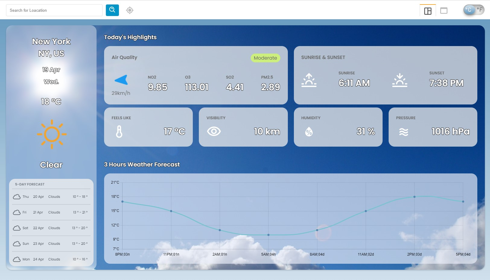
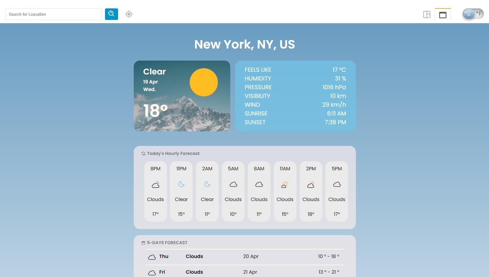

# Weather Forecast App

## Introduction
<p>Web application that shows the weather forecast of the location where you search. Provides simple version and dashboard version by your selecting. </p>





## Development Tools

* React Library - axios, react, chartjs, proptypes
```
    npm install axios
```
* Weather APIs - OpenWeather API: https://openweathermap.org/
* Geographic information APIs - GeoDB Cities API:https://rapidapi.com/wirefreethought/api/geodb-cities/


## Development Notes

### Creating simple react app for visualization
* In this part, it just created a react app for simple form on the web.
* Added header part that is clickable and hidden.
* If data does not exist, the result will not show on the screen.
* The result - Current Weather, Current Weather Details, Forecast Weather.

### APIs actions - geographic information, weather information
* Using APIs, took a geographic information by given city name.
* Using Weather APIs, took a current weather and forecast weather information by using a geographic information.

### Gethering Data
* Shapes data into new data form in order to use easily.
* Returns the result data in the array form.
* Uses map method in oreder to reduce repetitive code.
* Seperates the code in its own purpose, for instance, receiving APIs action, gethering data from the pure data form, and etc.

### Updates
* Shows many places when user types on the searching section.
* Two types of mode - Dashboard and Webapp version.
* Adds more detail information of weather forecast - air pollution, 3 hours forecast, chart etc.
* Default current location where you are.
* Changes celsius to fahrenheit and fahrenheit to celsius.
* Changes background color and image by weather conditions and current time(sunrise/sunset).
* Optimizes codes by using various hooks and components.

## Issues
* If there are more than two locations that have the same name each other, this application will take the first information in the list of the result. (Fixed)
* Several features able to Update. (Fixed)
    * Shows more detail information in the week forecast.
    * Various screen forms, including mobile and ipad mode. 
    * Using more proptypes in every form that displays on the screen.
* Checking errors when user types fast on the searching section.
    * Should change debounce components to shows various places smoothly.
* Setting Mobile version if it is necessary.